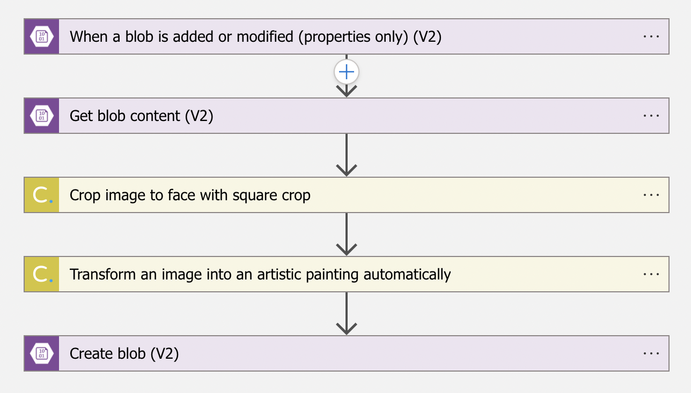

# Aplicación de ejemplo en Angular: Tour Of Heroes

En esta versión del proyecto basado en el tutorial de AngularJS se modifica el dashboard para visualizar las fotos de los top super héroes:

```
<h2>Top Heroes</h2>
<div class="heroes-menu">
    <a *ngFor="let hero of heroes" routerLink="/detail/{{hero.id}}">
        <!-- {{hero.name}} -->
        
    </a>
</div>
<app-hero-search></app-hero-search>
```

Gracias a esta Logic App:



