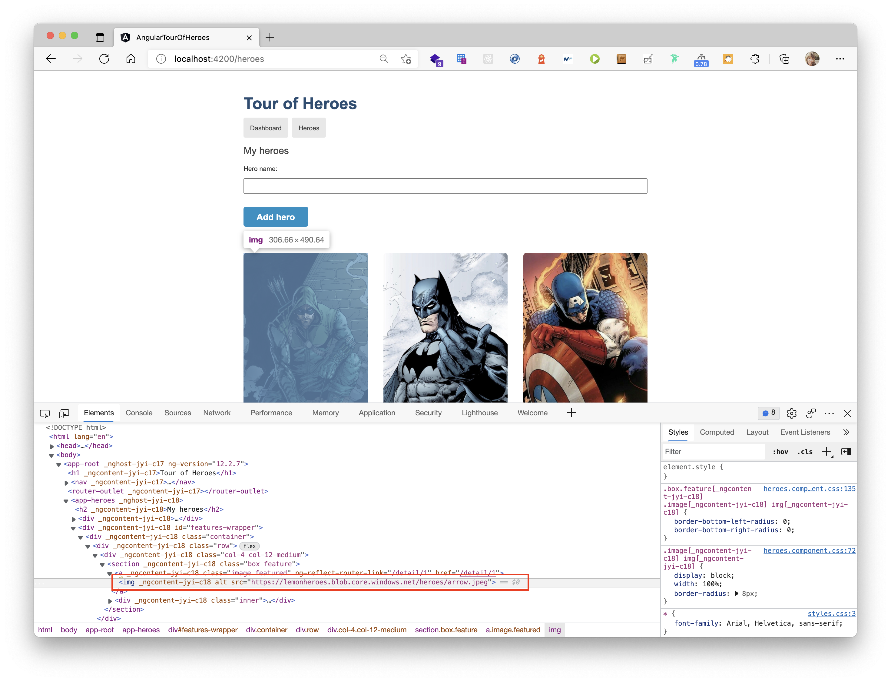
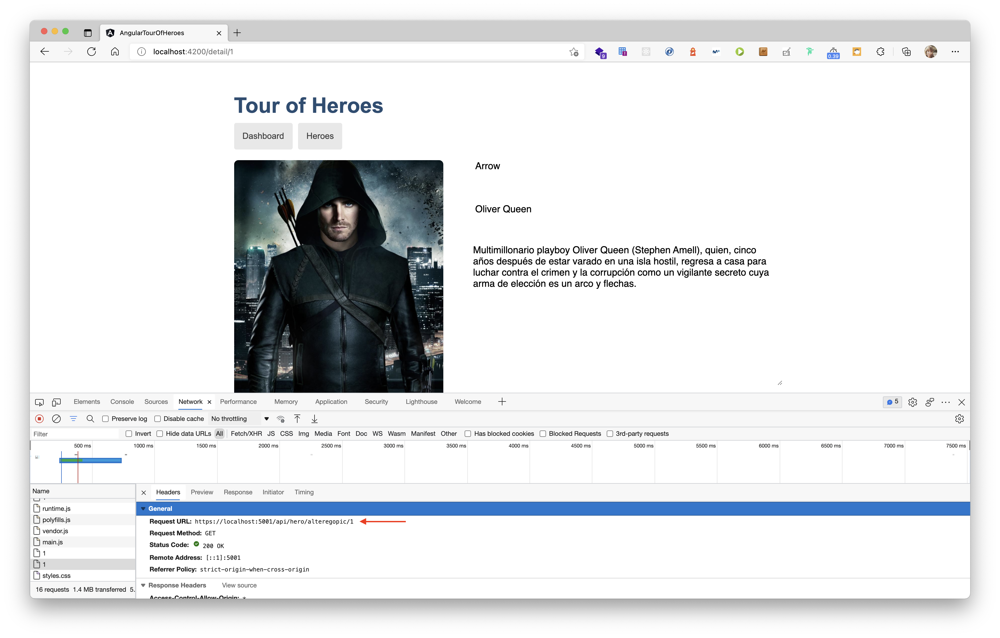

# Aplicación de ejemplo en Angular: Tour Of Heroes

En esta versión del proyecto, se crea una cuenta de almacenamiento en Azure Storage con estos comandos:

```
#Para ver todos los comandos que ofrece Azure CLI
az

#Para iniciar sesión en la suscripción sobre la que quieres operar
az login

#Variables
RESOURCE_GROUP="Tour-Of-Heroes"
STORAGE_NAME="<YOUR_STORAGE_ACCOUNT_NAME>"
LOCATION="northeurope"

#Crear una cuenta de almacenamiento dentro del grupo de recursos Tour-Of-Heroes
az storage account create --resource-group $RESOURCE_GROUP --name $STORAGE_NAME --location $LOCATION 
```

Se crean los contenedores para heroes y alterego

```
#Crear el contenedor de los superheroes
az storage container create --name heroes --account-name $STORAGE_NAME --public-access blob

#Crear el contenedor de los alter egos
az storage container create --name alteregos --account-name $STORAGE_NAME
```

Para subir los alteregos usamos el siguiente comando:

```
#Subir alteregos
az storage blob upload-batch --destination alteregos --source src/assets/alteregos/. --account-name $STORAGE_NAME
```

Para subir los heroes usando la herramienta [Microsoft Azure Storage Explorer](https://azure.microsoft.com/es-es/features/storage-explorer/)

Para que nuestra aplicación use estos archivos se ha modificado el archivo **app/heroes/heroes.component.html** para los súper heroes:

```
<h2>My heroes</h2>
<div>
    <label for="new-hero">Hero name: </label>
    <input id="new-hero" #heroName />

    <!-- (click) passes input value to add() and the clears the input -->
    <button class="add-button" (click)="add(heroName.value); heroName.value=''">
        Add hero
    </button>
</div>
<!-- <ul class="heroes">
    <li *ngFor="let hero of heroes">
        
        <a routerLink=" /detail/{{hero.id}} ">
            <span class=" badge ">{{hero.id}}</span> {{hero.name}} </a>

        <button class=" delete " title=" delete hero " (click)=" delete(hero) ">x</button>
    </li>
</ul> -->
<div id="features-wrapper">
    <div class="container">
        <div class="row">
            <div class="col-4 col-12-medium" *ngFor="let hero of heroes">
                <!-- Box -->
                <section class="box feature">
                    <!-- <a routerLink="/detail/{{hero.id}}" class="image featured"></a> -->
                    <a routerLink="/detail/{{hero.id}}" class="image featured">.blob.core.windows.net/heroes/{{hero.name | lowercase | replace: ' ':'-'}}.jpeg" alt="" /></a>
                    <div class="inner">
                        <header>
                            <h2>{{hero.name}}</h2>
                        </header>
                        <p>{{hero.description | slice:0:150}}...</p>
                        <button (click)="delete(hero)"> Delete</button>
                    </div>
                </section>
            </div>
        </div>
    </div>
</div>
```
En el caso de los alter egos se ha modiciado tanto el archivo **app/hero-detail/hero-detail.component.html**: 

```
<!-- <div *ngIf="hero">
    <h2>{{hero.name | uppercase}} Details</h2>
    <div><span>id: </span>{{hero.id}}</div>
    <div>
        <label for="hero-name">Hero name: </label>
        <input id="hero-name" [(ngModel)]="hero.name" placeholder="name">
    </div>
</div> -->
<div id="features-wrapper">
    <div class="container">
        <div class="row" *ngIf="hero">
            <div class="col-5 col-12-medium">
                <!-- Box -->
                <section class="box feature">
                    <!-- <a routerLink="/detail/{{hero.id}}" class="image featured"></a> -->
                    <a routerLink="/detail/{{hero.id}}" class="image featured"></a>
                    <!-- <a routerLink="/detail/{{hero.id}}" class="image featured"></a> -->
                </section>
            </div>
            <div class="col-7">
                <form>
                    <div class="form-group">
                        <label for="hero-name">
              <input id="hero-name" [(ngModel)]="hero.name" [ngModelOptions]="{standalone: true}" placeholder="Name">
              <span>Hero name</span>
            </label>
                    </div>
                    <div class="form-group">
                        <label for="hero-name">
              <input id="hero-name" [(ngModel)]="hero.alterEgo" [ngModelOptions]="{standalone: true}"
                placeholder="Alter ego">
              <span>Alter ego</span>
            </label>
                    </div>
                    <div class="form-group">
                        <label for="hero-name">
              <textarea id="hero-description" [(ngModel)]="hero.description" [ngModelOptions]="{standalone: true}"
                placeholder="Description"></textarea>
              <span>Description</span>
            </label>
                    </div>
                    <div class="buttons">
                        <button (click)="save()">Save</button>
                        <button (click)="goBack()">Go back</button>
                    </div>
                </form>
            </div>
        </div>
    </div>
</div> 
```
La variable de alterEgoPic se "rellena" gracias a la llamada que se hace para ese componente, en su archivo TypeScript, en **getHero()**, con getAlterEgoPic():

```
getHero(): void {
    const id = Number(this.route.snapshot.paramMap.get('id'));
    this.heroService.getHero(id).subscribe(hero => this.hero = hero);
    
    this.heroService.getAlterEgoPic(id).subscribe(alterEgoPic => {
      let reader = new FileReader();
      reader.onload = (e: any) => {
        this.alterEgoPic = e.target.result;
      };
      
      if (alterEgoPic){
        reader.readAsDataURL(alterEgoPic);
      }
      
    });
  }
```

## Cómo lo ejecuto

**IMPORTANTE**: Antes de ejecutar este proyecto necesitas tener la API en .NET ejecutándose. Más información [aquí](https://github.com/0GiS0/tour-of-heroes-dotnet-api) Sin embargo, para esta versión necesitas que sea el branch **azure-storage-pics**. Este debe tener configurado correctamente la cuenta de almacenamiento que has utilizado en esta parte.

Lo primero que debes hacer es descargarte el proyecto en local y apuntar al branch azure-storage-for-assets:

```
git clone https://github.com/0GiS0/tour-of-heroes-dotnet-api.git
git checkout azure-storage-for-assets
```

Instalar las dependencias con npm:

```
npm install
```

y por último ejecutarlo con start:

```
npm start
```
El proceso arrancará y estará disponible en esta dirección: [http://localhost:4200/](http://localhost:4200/)

## Resultado

El resultado de este cambio es el siguiente:

Desde el punto de vista de los heroes, ahora las imágenes son servidas desde Azure Storage, en un container con el nivel de acceso **blob**.



Desde el punto de vista de los alter egos, ahora se sirven a través de la API .NET, ya que su contenedor es privado y la web no tiene acceso a las imágenes directamente, sino es a través de la API.


